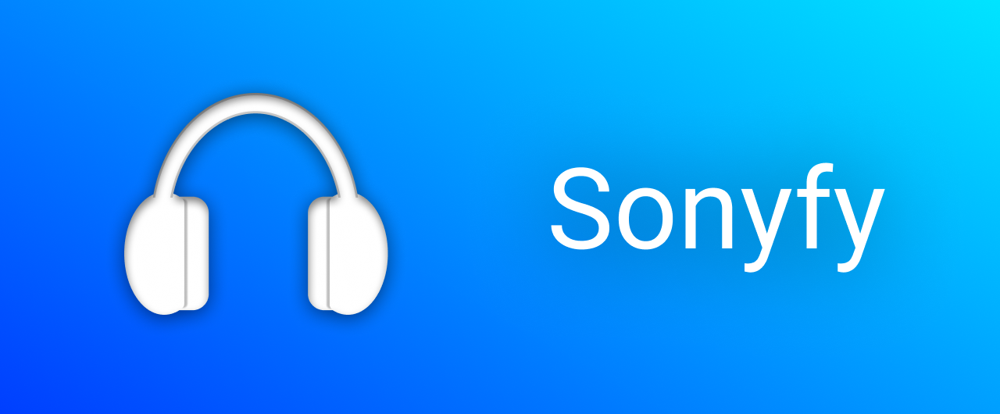

# Sonyfy
Bring the noise cancellation control of your Sony headphones to the built-in iOS menu.

# How does it work?
It uses the official Sony Headphones app to send specific noise cancelling information to your headphones.

# Does it work with other noise cancelling tweaks?
Yes! Sonyfy should work just fine with other noise cancelling (automation) tweaks, because it emulates the behavior of the official Airpods pro.

# Does it work with my headphones?
Sonyfy is currently tested on the WH-1000XM3, the WH-1000XM4, the WH-H910N, other headphones might work but I haven't tested it.
