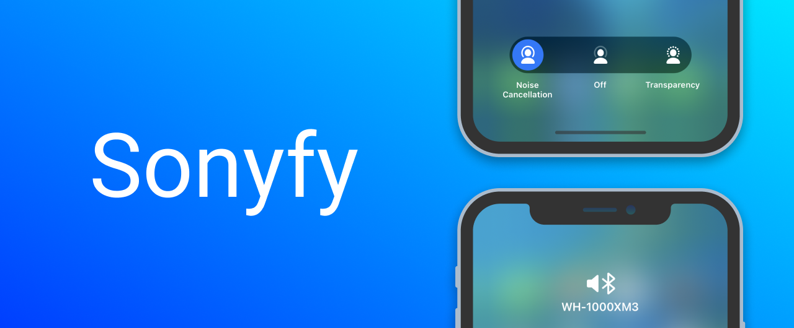

# Sonyfy
Bring the noise cancellation control of your Sony headphones to the built-in iOS menu.

# How does it work?
It uses the official Sony Headphones app to send specific noise cancelling information to your headphones.

# Does it work with other noise cancelling tweaks?
Yes! Sonyfy should work just fine with other noise cancelling (automation) tweaks, because it emulates the behavior of the official Airpods pro.

# Does it work with my headphones?
Sonyfy is currently tested and working on:
WH-1000XM2,
WH-1000XM3,
WH-1000XM4,
WH-H910N,
WF-1000XM3,
XB900N,
WI-C600N,
WH-CH700N,
WH-H900N

Other headphones might work but I haven't tested it.

Let me know if your device is supported but I haven't put it on the list yet :)  
@semvis123 on twitter.
